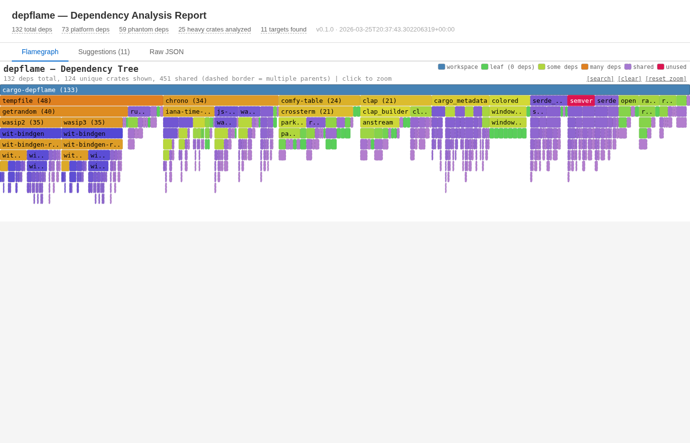

# cargo-depflame

Visualize your Cargo dependency tree as an interactive flamegraph. See exactly which crates pull in large transitive dep trees and where the weight lives.



## Install

```sh
cargo install cargo-depflame

# Or from source
cargo install --git https://github.com/sinelaw/cargo-depflame
```

Requires Rust 1.88+.

## Usage

```sh
cargo depflame
```

This opens an interactive HTML report in your browser with a flamegraph of your full dependency tree. Each bar's width represents the total transitive dependency count rooted at that crate — click to zoom in, hover for details.

Other output modes: `cargo depflame analyze` for a text summary, `cargo depflame analyze --format json` for machine-readable output.

## The flamegraph

The flamegraph is built directly from `cargo metadata` — the dependency structure, transitive weights, and feature gating it shows are exact, not heuristic. It lets you:

- Spot the heaviest subtrees at a glance
- Drill into any crate to see what it pulls in
- Identify diamond dependencies (crates pulled in by multiple paths)

The HTML report also includes an actionable suggestions tab with Cargo.toml diffs and a raw JSON tab.

## Heuristic suggestions

Beyond the flamegraph, depflame scans your source code to estimate how heavily each dependency is used and suggests concrete actions: remove unused deps, disable default features, feature-gate, or propose upstream PRs.

### How is this different from cargo-udeps / cargo-machete?

Both find unused deps. cargo-depflame also:

- Analyzes the full *transitive* graph and computes real savings (W_unique), not just "is it used?"
- Detects deps that are already optional upstream and shows you which feature flags to disable
- Suggests upstream PRs for feature-gating in external crates
- Works on stable (no nightly required, unlike cargo-udeps)

### Ignoring false positives

Some crates (e.g., `humantime_serde` used only via `#[serde(with = "...")]`) can't be detected by regex scanning. To suppress false "unused" reports, add the same `[package.metadata.cargo-machete]` section that cargo-machete uses:

```toml
[package.metadata.cargo-machete]
ignored = ["humantime_serde"]
```

Ignored crates still appear in the flamegraph — only the unused-dep suggestion is suppressed.

### Limitations

The suggestions rely on regex-based source scanning, so treat them as leads to investigate, not commands to execute blindly. The HTML report links to exact source lines for verification.

**Why heuristics?** The root cause is proc macros. A crate like `serde_derive` is invoked via `#[derive(Serialize)]` — the attribute name doesn't match the crate name, and there's no way to know this without running the compiler. depflame auto-detects proc-macro crates via `cargo metadata` and lowers confidence for them, but it can't count their actual usage.

Other known blind spots:

- Implicit trait impls and type-level usage are not detected
- Block comments and string literals can cause false matches
- `#[cfg(test)]` is tracked, but other `cfg` variants are not distinguished from unconditional code
- `build.rs` source is not scanned (build deps show as unused even when they aren't)

### Want more exact unused-dep detection?

- [**cargo-udeps**](https://github.com/est31/cargo-udeps) — uses the compiler to detect unused deps, so it handles proc macros correctly. Requires **nightly Rust** and a full `cargo check` (slow on large workspaces).
- [**cargo-machete**](https://github.com/bnjbvr/cargo-machete) — similar regex approach to depflame but focused purely on unused deps. Works on **stable**, very fast, supports `--fix` to auto-remove. Same proc-macro blind spot.

Neither tool analyzes transitive weight, suggests feature-gating, or produces flamegraphs — that's what depflame adds on top.

## License

MIT
