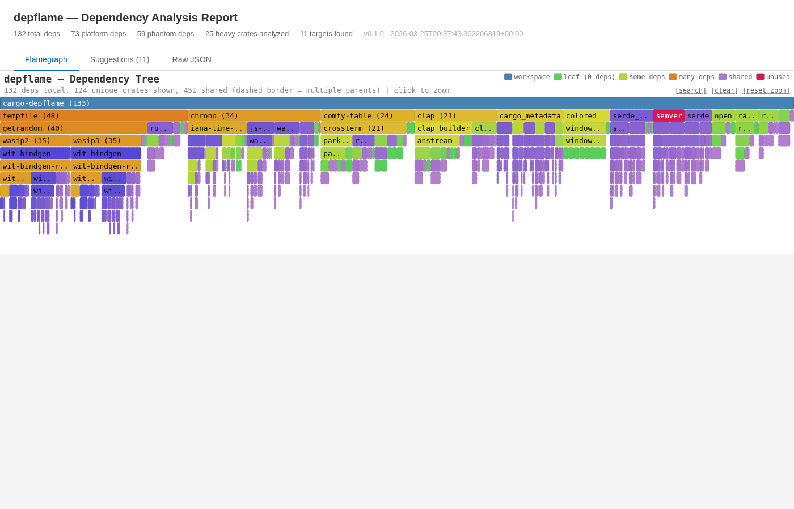

# cargo-depflame

Visualize your Cargo dependency tree as an interactive flamegraph. See exactly which crates pull in large transitive dep trees and where the weight lives.



## Install

```sh
cargo install cargo-depflame

# Or from source
cargo install --git https://github.com/sinelaw/cargo-depflame
```

Requires Rust 1.85+.

## Usage

```sh
cargo depflame
```

This opens an interactive HTML report in your browser with a flamegraph of your full dependency tree. Each bar's width represents the total transitive dependency count rooted at that crate — click to zoom in, hover for details.

Other output modes: `cargo depflame analyze` for a text summary, `cargo depflame analyze --format json` for machine-readable output.

## The flamegraph

The flamegraph is built directly from `cargo metadata` — the dependency structure, transitive weights, and feature gating it shows are exact, not heuristic. It lets you:

- Spot the heaviest subtrees at a glance
- Drill into any crate to see what it pulls in
- Identify diamond dependencies (crates pulled in by multiple paths)

The HTML report also includes an actionable suggestions tab with Cargo.toml diffs and a raw JSON tab.

## How shared is each transitive dep?

`W_unique` answers a strict question: what disappears if I drop this direct dependency? The sharing view answers the looser one: **for each transitive dep, how many of my top-level direct dependencies pull it in?**

```
Transitive deps by how many top-level deps pull them in (loosely unique first):

  workspace (all members) — 12 top-level deps, 66 transitive deps
  owner spread: 1×42  2×15  4×5  7×4
   #  Crate               Version  Owners  Pulled in by
  ──  ──────────────────  ───────  ──────  ────────────
   1  clap_builder        4.6.0         1  clap
  ...
  53  libc                0.2.183       2  dashmap, open
  63  syn                 2.0.117       7  cargo_metadata, clap, semver, serde, serde_json +2 more
```

An owner count of 1 means the crate vanishes with that single direct dep. A count of 2 or 3 out of dozens means it is *loosely* unique — dropping a couple of deps would still eliminate it. A count equal to your top-level dep total (`syn` above) means it is unavoidable. The `owner spread` line is a histogram of those counts: `2×15` reads "15 crates have exactly 2 owners".

Two scopes are computed: the whole workspace (the union of every member's direct deps) and one per workspace member. Workspace members are transparent — if `crate-a` depends on sibling `crate-b`, `crate-b`'s direct deps count as top-level for `crate-a` too. Edges follow cargo's own feature resolution, and deps not compiled for your current platform are excluded.

Text output shows the workspace scope; `--verbose` shows every row and the per-member breakdowns. In the HTML report, the **Sharing** tab has a scope selector, a max-owners filter, and sortable columns, and the Table tab gains an `Owners` column you can sort ascending to put the most uniquely-owned direct deps first.

## Switching platform

The analysis reports your own platform: the counts come from the crates cargo resolves for the host. The HTML report goes further — the **Platform** dropdown in the Table tab switches the whole report to any of the common targets (Linux gnu/musl, macOS, Windows, wasm), or to `every target` for the union.

The masks come from `cargo metadata --filter-platform <triple>` at analysis time, so cargo evaluates the `cfg(...)` expressions and the result is exact rather than a reimplementation of cfg matching. The resolves run in parallel and cost about a second on top of an analysis.

Switching target re-resolves everything downstream: the table's unique and owner counts, the flamegraph, and the removal simulator. A direct dep that doesn't build for the selected target is marked `not built for <triple>` rather than silently dropped, so you can tell a platform-gated dep from a feature-gated one. Selecting a non-host target counts as a modified view, the same as a removal — the status line names the target and the numbers are measured against the analysed graph.

The Sharing tab is computed server-side for the host and doesn't follow the dropdown.

## Simulating a removal

In the HTML report's **Table** tab, each direct dependency has a `Remove` checkbox. Tick one and the table recomputes, live: every other direct dep's unique transitive dep count and owner count update, and the header shows what the graph would cost (`2 removed — 72 → 53 crates (−19)`). The flamegraph follows — the removed crate and everything only it pulled in disappear from the chart, and the summary bar shows the new dep count.

Only direct dependencies of a workspace member can be removed — a crate that is merely transitive has its checkbox disabled, since dropping it isn't yours to make.

The interesting cases are the ones that save nothing. Removing a dep that another dep also pulls in leaves it in the graph, and the row says so (`still pulled in by tracing-subscriber`) while the crate that now solely owns that subtree absorbs it (its unique count jumps).

The Table tab also has a **Workspace features** picker: a checklist of your own crates' features. Turning one off re-resolves the graph exactly as `--no-default-features` would, so the table, the flamegraph and the simulator all follow: every dep's unique and owner counts recompute, a dep that is no longer enabled is marked `off in the current feature set`, and a crate a feature *adds* gets a new row tagged `new`. Feature selection and simulated removals compose.

While anything is toggled the table's numbers are computed live from the graph on screen rather than read from the saved analysis, and `was N` shows the difference from the report. The table's `Reset` clears removals but keeps your feature selection; the flamegraph's `Reset all` puts everything back.

## Analyzing a flat dependency list

If all you have is a flat list of crates (say, extracted from someone else's binary) rather than a workspace, `from-list` reconstructs the tree for you (requires the `remote` feature):

```sh
cargo depflame from-list deps.txt --open
```

The input is one crate per line (`name-1.2.3`, `name@1.2.3`, or `name 1.2.3`; unparseable lines are skipped with a warning). depflame fetches each crate's dependency metadata from the crates.io sparse index, resolves the dependency edges *between the listed crates*, and reverse-engineers the minimal set of root crates that transitively pulls in the entire list — i.e. the binary's likely direct dependencies. A synthetic root is placed above them, then the usual report is produced: the text table shows the roots ranked by unique transitive weight, and `--open` (or `--format html`) gives the interactive flamegraph.

Caveats: dev-dependencies are ignored, build-dependency edges are off by default (`--include-build` enables them), and optional edges are followed by default since the list doesn't record feature selections (`--skip-optional` disables them).

## Heuristic suggestions

Beyond the flamegraph, depflame scans your source code to estimate how heavily each dependency is used and suggests concrete actions: remove unused deps, disable default features, feature-gate, or propose upstream PRs.

### How is this different from cargo-udeps / cargo-machete?

Both find unused deps. cargo-depflame also:

- Analyzes the full *transitive* graph and computes real savings (W_unique), not just "is it used?"
- Detects deps that are already optional upstream and shows you which feature flags to disable
- Suggests upstream PRs for feature-gating in external crates
- Works on stable (no nightly required, unlike cargo-udeps)

### Ignoring false positives

Some crates (e.g., `humantime_serde` used only via `#[serde(with = "...")]`) can't be detected by regex scanning. To suppress false "unused" reports, add the same `[package.metadata.cargo-machete]` section that cargo-machete uses:

```toml
[package.metadata.cargo-machete]
ignored = ["humantime_serde"]
```

Ignored crates still appear in the flamegraph — only the unused-dep suggestion is suppressed.

### Limitations

The suggestions rely on regex-based source scanning, so treat them as leads to investigate, not commands to execute blindly. The HTML report links to exact source lines for verification.

**Why heuristics?** The root cause is proc macros. A crate like `serde_derive` is invoked via `#[derive(Serialize)]` — the attribute name doesn't match the crate name, and there's no way to know this without running the compiler. depflame auto-detects proc-macro crates via `cargo metadata` and lowers confidence for them, but it can't count their actual usage.

Other known blind spots:

- Implicit trait impls and type-level usage are not detected
- Block comments and string literals can cause false matches
- `#[cfg(test)]` is tracked, but other `cfg` variants are not distinguished from unconditional code
- `build.rs` source is not scanned (build deps show as unused even when they aren't)

### Want more exact unused-dep detection?

- [**cargo-udeps**](https://github.com/est31/cargo-udeps) — uses the compiler to detect unused deps, so it handles proc macros correctly. Requires **nightly Rust** and a full `cargo check` (slow on large workspaces).
- [**cargo-machete**](https://github.com/bnjbvr/cargo-machete) — similar regex approach to depflame but focused purely on unused deps. Works on **stable**, very fast, supports `--fix` to auto-remove. Same proc-macro blind spot.

Neither tool analyzes transitive weight, suggests feature-gating, or produces flamegraphs — that's what depflame adds on top.

## License

MIT
